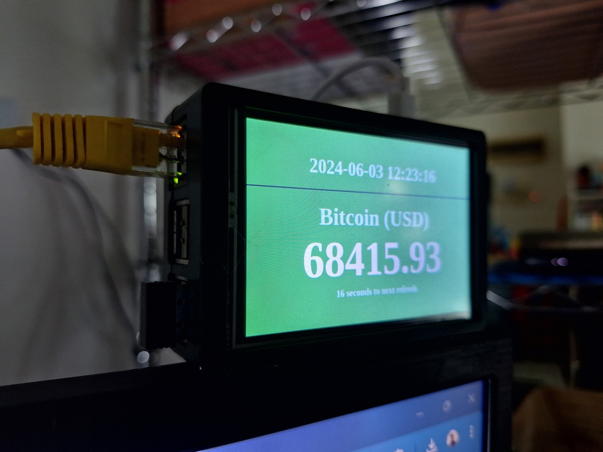

# bitcoin-price-display

A small project to repurpose my old [Raspberry Pi 2 Model B](https://www.raspberrypi.com/products/raspberry-pi-1-model-b-plus/) with [3.5" 320*480 TFT Touch Screen LCD Display](http://www.lcdwiki.com/3.5inch_RPi_Display) as a Bitcoin price ticker.

**Preview URL:** [https://heiswayi.github.io/bitcoin-price-display](https://heiswayi.github.io/bitcoin-price-display/)

