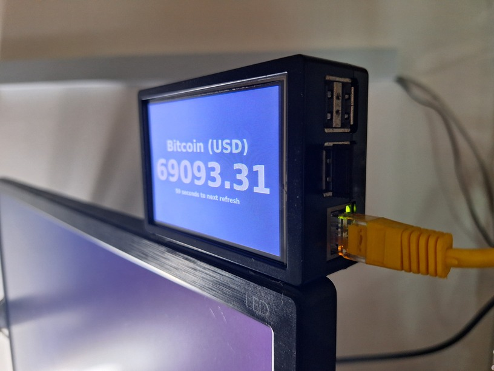

# bitcoin-price-display

A small project to repurpose my old [Raspberry Pi 2 Model B](https://www.raspberrypi.com/products/raspberry-pi-1-model-b-plus/) with [3.5" 320*480 TFT Touch Screen LCD Display](http://www.lcdwiki.com/3.5inch_RPi_Display) as a Bitcoin price ticker.



## Setup

1. Install any Linux OS into the RPi board, e.g. Raspberry Pi OS with desktop environment.
2. Ensure the 3.5" display screen is working. Can refer to [here](http://www.lcdwiki.com/3.5inch_RPi_Display) for the driver installation details.
3. Disable screensaver.
4. Install web server
   ```
   sudo apt-get install lighttpd
   ```
5. Place [index.html](index.html) file into `/var/www/html/` folder.
6. Install Chromium browser
   ```
   sudo apt-get install chromium-browser
   ```
7. Run the Bitcoin price ticker page in kiosk mode
   ```
   chromium-browser --noerrdialogs --kiosk http://localhost
   ```